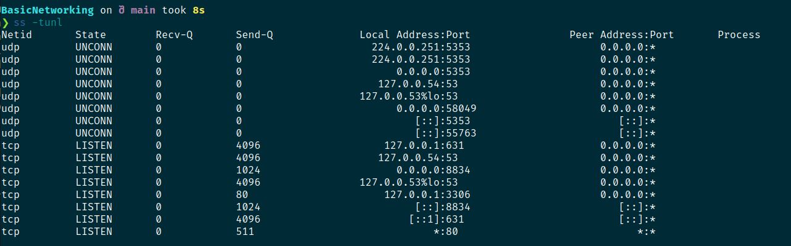

Tanggal: 6 Desember 2025
Topik: Networking 

---

## 🎯 Tujuan Belajar Hari Ini
- Memahami konsep lalu lintas jaringan yang sebenarnya terjadi

---

## 🧠 Teori Inti (Versi Singkat + Padat)
- TCP dan UDP memiliki sebuah perbedaan meskipun keduanya secara teknis memiliki fungsi yang sama, yaitu
  sebagai jembatan untuk berkomunikasi antar komputer melalui jaringan. Pada materi yang saya pelajari
  TCP lebih lambat dibandingkan denggan UDP, akan tetapi TCP dapat mengirim data secara utuh dan lengkap,
  biasanya TCP digunaakan untuk aplikasi seperti Gmail dan WhatsApp untuk chat karena kedua apliaksi tersebut harus
  bisa mengirim data berupa (pesan, gambar, ataupun video) secara lengkap.
  sedangkan UDP, UDP lebih cepat dibandingkan TCP. Akan tetapi UDP memiliki kekurangan, yaitu data yang
  dikirim tidak di periksa terlebih dahulu, dan besar kemungkinan data yang dikirim bisa rusak atau kurang
  lengkap. UDP cocok untuk sesuatu yang membutuhkan kecepatan super seperti contohnya game online.

---

## 🔧 Tools yang Digunakan
- Tool 1 : Shell
- OS / VM yang dipakai : Mint Linux

---

## 🧪 Praktik / Lab
### 1. Setup
Langkah awal:
- OS : Mint Linux
- Jaringan : WIFI
- Tool : Shell

### 2. Eksekusi
- ss -tunl
- sudo nmap 127.0.0.1

### 3. Hasil yang Didapat

- 

- ❯ sudo nmap 127.0.0.1
[sudo] password for damar:     
Starting Nmap 7.94SVN ( https://nmap.org ) at 2025-12-06 11:34 WIB
Nmap scan report for localhost (127.0.0.1)
Host is up (0.000014s latency).
Not shown: 997 closed tcp ports (reset)
PORT     STATE SERVICE
80/tcp   open  http
631/tcp  open  ipp
3306/tcp open  mysql

Nmap done: 1 IP address (1 host up) scanned in 0.19 seconds

---

## ❗Error & Masalah yang Ditemui
- Dalam praktik ini aku tida menumukan eror apapun, semuanya berjalan denggan lancar!

---

## 🔐 Security Insight (Wajib)
- Celah apa yang bisa dimanfaatkan : Hacker bisa melakukan serangan DDoS untuk lewat port UDP.
                                     Hacker juga bisa melakukan serangan brute force melalui port TCP,

- Contoh serangan dunia nyata : Hacker membanjiri server denggan request palsu sehingga server kewalahan
                                dan gagal meresponse request dari user asli.

- Dampak ke sistem            : Server menjadi lambat, delay, dan tidak responsive

---

## 🧠 Catatan Pribadi
### - Bagian yang masih membingungkan : 
Materi yanng aku pelajari kaliini tidaklah terlalu membingungkan bagiku,
hanya saja aku masih kesulitan untuk membuat suatu analgi atau membuat
rangkaian kata supaya aku bisa menjelaskan ulang materi ini di dalam jurnal.
namun secara teknis dan secara konsep aku sepenuhnya paham!

### - Hal paling penting hari ini : 
- Aku mempelajari perbedaan antara TCP dan UDP, serta denggan ini nantinya aku bisa
memprediksi kira-kira resiko apa yang akan terjadi jika aku menggunakan ini.

- Aku juga mempelajari Three Way Handshake hariini, materi ini mencangkup
_SYN (Client -> Server), SYN-ACK (Server -> Client), ACK (Client -> Server)_ .
Dari ketiga hal tersebut aku menganalogikan bahwa tahapan utama saat ingin
terjadi komuikasi anatara klien dan server melalu internet itu harus melewati 3 tahapan,
tahap pertama yaitu Klien memanggil server, kedua server meresponse dan mengonfirmasi
apakah user yang sebelumnya mengirim request benar benar ada, lalu tahap ketiga adalah user mengonfirmasi,
baru setelah itu tahapan transfer data antara server dan client dapat terjadi.

- Selain itu aku juga sempat mempelajari dan menghafal common Port pada materi tadi,
yaitu port 21 unutk service FTP, 22 -> SSH, 23 -> Telnet, 80 -> HTTP, 443 -> HTTPS,
3306 -> MYSQL. Port port ini adalah port yang sering muncul dan sering di exploitasi.

- ### Rencana besok : 
- Belajar Tools nmap dan Enumeration